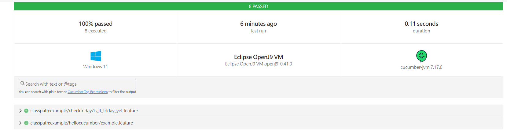

# 使用方式

## Step1. Intellij 安裝套件
1. Cucumber for Java
2. Gherkin
3. 引入 dependency 參考 -> [pom.xml](pom.xml)

## Step2. 建立Runner
參考 -> [RunCucumber.java](src%2Ftest%2Fjava%2Fexample%2FRunCucumber.java)
```java
@Suite
@IncludeEngines("cucumber") // 這個測試類將使用 Cucumber 引擎來運行測試。
@SelectPackages("example") // 選擇要運行的package
@ConfigurationParameter(key = PLUGIN_PROPERTY_NAME, value = "pretty") // 輸出格式
@ConfigurationParameter(key = PLUGIN_PROPERTY_NAME, value = "html:target/cucumber-report.html") // 輸出格式
public class RunCucumber {
}
```

## Step3. 建立Feature
參考 -> [is_it_friday_yet.feature](src%2Ftest%2Fresources%2Fexample%2Fcheckfriday%2Fis_it_friday_yet.feature)
```gherkin
# 測試的名稱
Feature: Is it Friday yet?
  # 功能的描述
  Everybody want to know when it's Friday

  # 測試案例的名稱
  Scenario Outline: Check if it's Friday
    Given today is "<weekday>"
    When I ask whether it's Friday yet
    Then I should be told "<answer>"

    Examples:
      | weekday   | answer |
      | Sunday    | No     |
      | Monday    | No     |
      | Tuesday   | No     |
      | Wednesday | No     |
      | Thursday  | No     |
      | Friday    | Yes    |
      | Saturday  | No     |
```
## Step4. 建立Step Definition
參考 -> [StepDefinitions.java](src%2Ftest%2Fjava%2Fexample%2Fcheckfriday%2FStepDefinitions.java)
```java
import static org.junit.jupiter.api.Assertions.assertEquals;

import io.cucumber.java.en.Given;
import io.cucumber.java.en.Then;
import io.cucumber.java.en.When;

public class StepDefinitions {

  private String today;
  private String answer;

  @Given("today is {string}") // 對應到Feature中的Given
  public void today_is(String weekday) {
    today = weekday;
  }

  @When("I ask whether it's Friday yet") // 對應到Feature中的When
  public void i_ask_whether_it_s_friday_yet() {
    CheckFriday checkFriday = new CheckFriday();
    answer = checkFriday.check(today);
  }

  @Then("I should be told {string}") // 對應到Feature中的Then
  public void i_should_be_told(String string) {
    assertEquals(string, answer);
  }

}
```
[CheckFriday.java](src%2Fmain%2Fjava%2Fexample%2Fcheckfriday%2FCheckFriday.java)
```java
public class CheckFriday {

  public String check(String today) {
    return "Friday".equalsIgnoreCase(today) ? "Yes" : "No";
  }
}
```

## Step5. 產出報告
[cucumber-report.html](target%2Fcucumber-report.html)
